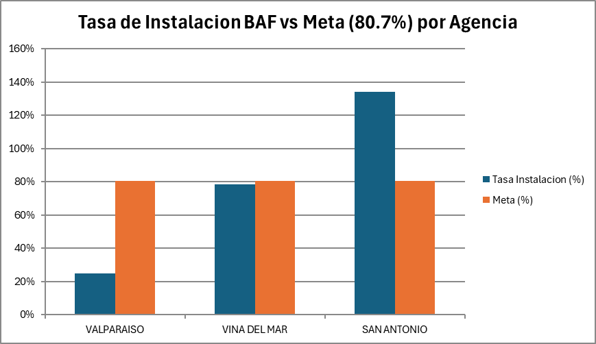

# Tasa de Instalación BAF — ELECNOR — P12 Agosto 2026

KPI operativo/comercial que mide el porcentaje de órdenes de venta BAF (banda ancha fija) que terminaron con una instalación técnica completada, por agencia zonal.

## Definición del KPI

**Numerador** — Archivo `p12_TOA_ELECNOR_2026-08.xlsx` (sistema TOA), agrupado por `XA_ORIGINAL_AGENCY_NAME`, contando `APPT_NUMBER_CD`, filtrado por:
- `STATUS_CD = complete`
- `XA_WORK_TYPE_ID` cuyos dos primeros caracteres correspondan a **"AT"** (productos BAF)

**Denominador** — Archivo `Maestro_Ventas_Elecnor_2026-08.xlsx`, agrupado por `AGENCIA_ZONAL_INSTALACION`, contando `ORDEN`:

```
Denominador = Q(TIPO = Emisión) − Q(TIPO = Cancelada)
```

**Meta:** 80,7%

## Resultado

| Agencia | Numerador | Emisión | Cancelada | Denominador (neto) | Tasa Instalación | Meta | Brecha | Cumple |
|---|---:|---:|---:|---:|---:|---:|---:|:---:|
| Valparaíso | 341 | 1.541 | 172 | 1.369 | 24,9% | 80,7% | -55,8% | ❌ |
| Viña del Mar | 659 | 927 | 89 | 838 | 78,6% | 80,7% | -2,1% | ❌ |
| San Antonio | 177 | 145 | 13 | 132 | 134,1% | 80,7% | +53,4% | ⚠️ |
| **Total** | **1.177** | **2.613** | **274** | **2.339** | **50,3%** | **80,7%** | **-30,4%** | ❌ |



## Notas y advertencias

- **San Antonio supera el 100%**, lo cual no es matemáticamente posible en una tasa real. Causa probable: desfase temporal entre fuentes — el numerador (p12) solo cubre el 1-15 de agosto, mientras el denominador (Maestro_Ventas) incluye órdenes cuya emisión original fue en julio y que se instalaron/completaron en agosto. Antes de reportar esta cifra a negocio se recomienda validar cruzando por número de orden individual entre ambos sistemas.
- Solo Viña del Mar se acerca a la meta (a -2,1 puntos); Valparaíso concentra la mayor brecha en volumen absoluto.
- Los nombres de agencia coinciden textualmente entre ambos archivos (`VALPARAISO`, `VINA DEL MAR`, `SAN ANTONIO`), pero no se validó que identifiquen exactamente la misma unidad operativa en ambos sistemas de origen.

## Estructura del repositorio

```
├── README.md
├── datos/
│   ├── numerador_p12_filtrado.csv       # detalle de instalaciones completadas AT/BAF (fuente: p12)
│   └── denominador_maestro_ventas.csv   # detalle completo de órdenes Emisión/Cancelada (fuente: Maestro_Ventas)
├── reportes/
│   └── Reporte_Tasa_Instalacion_BAF_2026-08.xlsx   # workbook con fórmulas vivas, detalle y gráfico nativo
└── graficos/
    └── tasa_instalacion_vs_meta.png
```

## Fuentes

- `p12_TOA_ELECNOR_2026-08.xlsx` (sistema TOA — field service, agosto 2026)
- `Maestro_Ventas_Elecnor_2026-08.xlsx` (maestro de órdenes de venta, período 202608)
